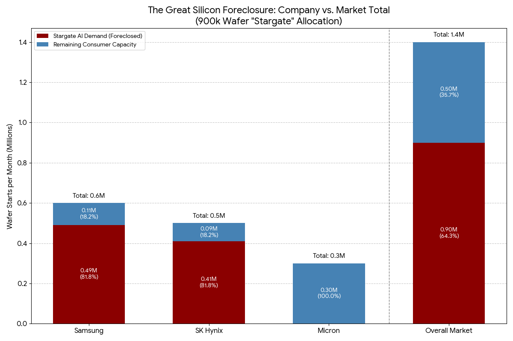

[readme.md](https://github.com/user-attachments/files/24153299/readme.md)

# **The Great Silicon Heist: How the Capacity Foreclosure Ate Your Future**

## Part I: The Table, The Players, and The Lockout

### **The Prologue: The Record Scratch (December 12, 2025\)**

For the last three years, Western semiconductor strategy has relied on a single, arrogant axiom: **Physics is a wall.**

The assumption was simple. We believed that by denying China access to **Extreme Ultraviolet (EUV)** lithography machines. The $300 million tools made solely by the Dutch firm ASML, required to print the world’s most advanced chips, we had effectively frozen their technological clock. We built a fortress around the future, operating under the certainty that the "Red Tier" of the global market would be stuck scavenging for 7-nanometer scraps while the West ascended to digital godhood.

That axiom died on **December 12, 2025**.

On that morning, analysts at TechInsights confirmed that **SMIC (Semiconductor Manufacturing International Corporation)**, China’s state-championed foundry, had achieved volume production of a **5-nanometer-class chip** using their "N+3" process. Crucially, they did this without a single EUV tool. Instead, they brute-forced the physics using older **Deep Ultraviolet (DUV)** machines, running the silicon wafers through the printers four times in a technique known as "quadruple patterning".

Western engineers had long dismissed this approach as "economically suicidal" because it is slow, expensive, and prone to defects. But they forgot the most important variable in the equation: For a sovereign state facing an existential threat, "profit" is optional. **Survival is mandatory**.

The "Heist", the Western plan to corner the high-end chip market—was supposed to be a clean getaway. But now, the getaway car has a flat tire, and the competitors we thought we had locked in the basement have just kicked down the door.

---

### **I. The Actors (The Game Theory of Greed)**

To understand how the average consumer got priced out of the future, you have to look beyond the headlines. This isn't a shadowy conspiracy discussed in a smoke-filled room; *it is a rigid system of open incentives*. The market has been restructured so that "gouging the consumer" is the only rational move for every player at the table.

The board is controlled by three distinct groups, each acting out of a specific, desperate logic.

#### **1\. The Hyperscalers (The "Whales")**

* **The Players:** OpenAI, Microsoft, Google, Meta, and the "Stargate" Consortium.  
* **The Motivation:** **The Prisoner’s Dilemma.**

These companies are not collaborating; they are trapped in a Mexican Standoff. Consider the logic of the procurement officer: If Microsoft secures 100,000 units of **High Bandwidth Memory (HBM)**, Google cannot simply buy 100,000 units to match them. To be safe, Google must buy *200,000* units; not just to use them, but to deny Microsoft future capacity.

This dynamic has triggered a "Meta-Move" in the industry. These companies wield balance sheets that rival the **Gross Domestic Product (GDP)** of G7 nations. They realized that technological innovation is no longer the primary barrier to entry; **liquidity is**. By buying all the wood, steel, and springs in the world, they ensure that no startup can build a better mousetrap. They haven't just bought the chips; they have weaponized their bank accounts to purchase the entire supply chain.

#### **2\. The Memory Triad (The "House")**

* **The Players:** Samsung, SK Hynix, and Micron.  
* **The Motivation:** **Trauma Response.**

For decades, these three companies battered each other in what economists called the "Pork Cycle." They would spend billions building new fabrication plants ("fabs"), only to flood the market with chips, causing prices to crash. They lived in constant fear of oversupply.

The rise of AI offered them a way out. They have effectively unionized against the consumer, shifting their business model from selling a commodity (chips) to selling a service (guaranteed capacity). The Memory Triad presented the Hyperscalers with an ultimatum: *"We will build the fabs you need, but only if you pay for them upfront, plus a guaranteed profit, regardless of whether the AI bubble bursts"*. This "Cost-Plus" model transfers all the risk from the manufacturer to the buyer, insulating the Memory Triad from the market cycles that used to terrify them.

#### **3\. The Policy Engine (The "Enforcers")**

* **The Players:** The Pentagon, the Department of Commerce, and the National Security Apparatus.  
* **The Motivation:** **Imperial Panic.**

In the early 2000s, the **Department of Justice (DOJ)** actively hunted memory executives for price-fixing, eventually sending Vice Presidents from Samsung and Hynix to federal prison for rigging the market.

Today, those same behaviors are protected under the guise of "Industrial Policy". Because the Memory Triad produces the silicon required for missile guidance systems and next-generation fighter jets, they have become "Too Strategic to Fail". The government has hacked the payoff table: Behavior that was once prosecuted as "Antitrust" has been renamed "Patriotism". The referees have left the field, and the monopolies are now deputized by the state.

## Part II: The Foreclosure — "Privatizing Time"

### **II. The Mechanism: The "Wafer Start" Blockade**

The heist began with a lie by omission. When the financial press reported that the "Stargate" joint venture—the massive AI infrastructure project backed by the Hyperscalers—had "secured supply" for their data centers, the world nodded and moved on. The narrative was simple and seemingly benign: A big customer placed a big order.

*The reality was a structural foreclosure of the global market*. They didn't just buy the bread; they rented the bakery and locked the doors.

#### **1\. The Physics of the "Wafer Start"**

To understand the violence of this move, you have to understand the fundamental unit of the semiconductor economy: the **"Wafer Start."**

A wafer start is not a finished product; it is a reserved slot in four-dimensional space-time. It represents the rental of the lithography scanner, the chemical baths, and the physicist’s billable hours required to process a single slice of silicon.

Global capacity for **Dynamic Random Access Memory (DRAM)** is finite, hovering around **1.5 million wafers per month**. According to industry reports, the Stargate entity and its peers have secured agreements for up to **900,000 wafer starts per month**.

Do the math. That is roughly **60% of the planet's capacity** to produce memory, annexed by a private club. Crucially, these contracts are for "undiced wafers." This means the Hyperscalers control the raw output of the factory. Whether those wafers yield usable chips or turn into scrap is irrelevant to the contract; the factory floor itself has been privatized.

#### **2\. The Financial Weapon: The "Call Option" on the Future**

This transaction wasn't a standard purchase order; it was a complex financial derivative designed to insulate the manufacturer from risk.

Historically, the Memory Triad bore the immense risk of building a factory. If demand dropped, they lost billions. The Hyperscalers changed the game by offering **"Cost-Plus" contracts**. They agreed to pay for the factory time *regardless of yield*.

This is effectively a massive **Call Option** on the future of compute. The Hyperscalers paid a premium to reserve the right to the majority of the world's silicon, transferring all financial risk from the manufacturer (The Memory Triad) to the buyer. *The result is that the Memory Triad no longer needs to compete for your business; they have already been paid by the "Whale".*

#### **3\. The HBM Cannibalization (The 3-to-1 Problem)**

A common question from consumers is: *"Why does an AI boom make my laptop's SSD or RAM more expensive? They use different chips."*

The answer lies in the physics of **High Bandwidth Memory (HBM)**, the specialized memory used in AI accelerators. HBM is physically gluttonous. Producing a single gigabyte of HBM capacity consumes roughly **three times the wafer area** of standard DDR5 memory.

Because the fab is a zero-sum game, every wafer the Memory Triad allocates to HBM is effectively **three wafers stolen** from the consumer market. *They haven't just "shifted focus"; they have cannibalized their own production lines*. They are stripping the copper wiring out of the economy class cabin to gold-plate the cockpit.

#### **4\. The "Transformer Starts" Blockade (The Hidden Grid Choke)**

The foreclosure extends beyond the silicon. To run these chips, you need massive amounts of electricity, and the bottleneck has shifted to the grid itself.

Just as they monopolized wafer starts, the Hyperscalers are now pre-booking **"Transformer Starts"**. The lead times for high-voltage transformers, gas-insulated switchgear, and substations—the heavy iron required to electrify a data center—have blown out to 3–4 years. The Hyperscalers are essentially privatizing the output of companies like GE and Siemens, ensuring that the physical infrastructure required to power the AI revolution is unavailable to anyone else.

#### **5\. The Eviction: Why Your RAM Costs $150**

With 60% of the factory floor legally ring-fenced for AI, the remaining 40% of the market has become a bloodsport.

Companies like Dell, HP, Apple, and the automotive giants are left to fight over this minority share of global capacity. Because supply is artificially constrained, the Memory Triad can charge a "nuisance fee" on legacy chips like DDR5.

The shortage of PC memory isn't because we lack the technology to make it; it's because the machines that *should* be making it are busy serving the Hyperscalers. In a healthy market, "trash" chips (silicon that doesn't meet top-tier specs) filter down to consumers to keep prices low. Under this regime, the "trash" has been monetized.

The consumer market wasn't outbid in a fair auction. **It was evicted**.

## Part III: The Technical Choke — "The Silicon Glue"

### **III. The Triad’s Casino: "Heads I Win, Tails You Lose"**

The average person thinks a microchip is "printed" like a newspaper: You shine a light through a lens, you etch the silicon, and out pops a Pentium processor. That mental model was true in 2010\. It is dangerously obsolete today.

In 2026, an AI accelerator like Nvidia’s **Rubin** or AMD’s **MI400X** is not a chip in the traditional sense. It is a **construction project**. It is a "Franken-chip" monster of disparate silicon organs stitched together with microscopic wiring, and the surgery required to assemble it is so violent that it has created a bottleneck tighter than the factory itself.

#### **1\. The Logistics of the "Franken-Chip"**

To understand why you can't buy a GPU, you have to trace the mileage on the silicon. A modern AI package doesn't just come off a line; it goes on a global tour of failure points.

The assembly requires four distinct components, often manufactured in four different countries:

* **The Logic Die (The Brain):** Printed by TSMC in Taiwan on a 3-nanometer or 2-nanometer process.  
* **The Memory (The HBM):** Printed by the Memory Triad (Samsung, SK Hynix, Micron) in Korea or Japan.  
* **The Interposer (The Plate):** A massive, passive slice of silicon required to connect the brain to the memory.  
* **The Substrate (The Foundation):** The fiberglass-epoxy base that holds it all, currently suffering from a global shortage of **ABF (Ajinomoto Build-up Film)**.

**The Mileage:** Before an AI chip is born, its components have likely crossed the ocean **four times**. The **High Bandwidth Memory (HBM)** wafers must be ground down to the thickness of a human hair, drilled with thousands of vertical tunnels called **Through-Silicon Vias (TSVs)**, and stacked 8 to 12 layers high.

They are then shipped to a separate "Advanced Packaging" facility—specifically, TSMC’s **Chip-on-Wafer-on-Substrate (CoWoS)** plants. There, a robotic arm must place the HBM stacks millimeters away from the GPU logic die on the interposer with sub-micron precision.

**The Risk:** This is a suicide pact. If the "glue" fails, or if the heat warps the interposer, you don't just lose the packaging; **you lose the logic die and the memory too**. Three of the most expensive components on earth die together.

#### **2\. The Second Velvet Rope: CoWoS and the OSAT Queue**

Just as they monopolized the wafer starts, the Hyperscalers have foreclosed on the packaging facilities. Reports suggest that Nvidia and its peers have booked over **50–60% of available CoWoS capacity** through 2026\.

You might ask, "Why don't other companies just build more packaging plants?" They are trying. **Outsourced Semiconductor Assembly and Test (OSAT)** companies like ASE and Amkor are aggressively expanding. But there is a catch: **Qualification Cycles**.

It takes 9 to 12 months to certify a new packaging line for a high-end chip. You cannot simply move a $40,000 AI brain to a new factory overnight; the yield risk is too high. So, while the OSATs are expanding, the Hyperscalers effectively own the only lines that are currently certified to work, leaving everyone else in a queue that stretches into 2027\.

#### **3\. The HBM4 Trap: The Death of Interchangeability**

We are now entering the era of **HBM4**, the next generation of memory, and with it, the final death of the commodity market.

In the old world (HBM3E), memory was a standard part. If Samsung’s yield was poor, Nvidia could technically swap in SK Hynix modules. They were interchangeable tires on a car.

In the new world of HBM4, the "Base Die" of the memory stack is no longer a generic memory controller. It is a **custom logic chip** designed by the GPU maker (Nvidia or AMD) and manufactured on a logic node (12nm or 5nm).

**The Lock-In:** This means the memory is no longer a "part" you buy off the shelf; it is a **custom organ** grown specifically for the host. There are no interchangeable parts for the Nvidia Rubin architecture. The Memory Triad has effectively become a contract manufacturer for the Whales. Since SK Hynix cannot sell that custom HBM4 to anyone else, they are empowered to demand that Nvidia pays for the factory upfront.

#### **4\. The "Fabless" Kings and the Riskless Serfs**

This shift represents the ultimate evolution of the "Fabless" business model.

* **The Kings:** Nvidia and AMD own the Intellectual Property (IP), the software (CUDA/ROCm), and the profit margins. They own **zero** factories and take **zero** manufacturing risk.  
* **The Serfs (The Memory Triad):** Samsung, Hynix, and Micron do the dirty work. They handle the toxic chemicals, the massive electricity bills, and the yield headaches.

In the past, the Serfs resented this dynamic. But the "Stargate" Consortium changed the deal. By signing long-term **Cost-Plus** contracts, the Kings agreed to underwrite the Serfs' risk.

**The Outcome:** The Memory Triad has hitched their wagons to the "Fabless" star. They no longer care if the AI bubble bursts in 2027, because the Kings have already paid for the capacity through 2028\. The consumer is left standing in the cold, waiting for DDR5 scraps from a factory that has been fully booked, prepaid, and retooled to build custom organs for a machine god.

## Part IV: The Patriot Tax — The Price of Our Fear

### **IV. The "Warm Idle" Graveyard**

In a functioning capitalist economy, capital equipment flows downhill like water. When a giant like TSMC upgrades to the latest **High-NA EUV (High Numerical Aperture Extreme Ultraviolet)** scanner—a $380 million machine—their "old" machines typically trickle down to second-tier foundries. These older tools are then used to print the chips that run your toaster, your Ford F-150, and your Wi-Fi router.

That river has been dammed by the **Department of Commerce**. To prevent China from achieving technological parity, the West didn't just ban the sale of new machines; **we froze the secondary market**. We created a "Geopolitical Graveyard" where billions of dollars in advanced lithography equipment sit in a state of expensive purgatory known in the industry as **"Warm Idle"**.

#### **1\. The Physics of the "Patriot Tax"**

The term "Warm Idle" sounds benign, like a car parked in a garage. The reality is far more expensive. You cannot simply unplug a photolithography scanner. It is a precision instrument containing mirrors polished to atomic smoothness; it requires a deep vacuum seal, constant thermal regulation, and a team of engineers to monitor it. If the temperature fluctuates by a fraction of a degree or the optics gather dust, the machine is effectively bricked.

*So, we keep them on.*

* **The Burn Rate:** A single EUV tool consumes approximately 1 to 1.4 Megawatts of power. That is roughly **24–30 Megawatt-hours per day**.  
* **The Bill:** At industrial electricity rates, keeping *one* machine idle costs roughly **$2,000–$4,500 per day** in electricity alone.  
* **The Ransom:** Beyond power, you need a service contract to keep the system calibrated. These contracts cost between **$5 million and $10 million per year**, per machine.

We are currently burning hundreds of millions of dollars annually to power empty rooms. We are paying rent to store our own paranoia. And who pays for this waste? **You do**. These costs are amortized into the overhead of the manufacturers and passed down to the consumer. When you buy a GPU today, you are paying a surcharge for the silicon the Chinese *didn't* get.

#### **2\. The Broken Blockade: The "Maginot Line" of EUV**

For three years, this waste was justified by a single, unwavering promise: **"It works."** We were told that by denying China access to EUV, we had locked them out of the 5-nanometer club forever.

The news on **December 12, 2025**, exposed that promise as a lie.

* **The Breach:** SMIC’s achievement of **5nm-class production (N+3)** using older **Deep Ultraviolet (DUV)** machines proved that the blockade was never a wall; it was merely a speed bump.  
* **The Unintended Consequence:** We forced them to innovate. By cutting off the "easy mode" (EUV), we forced Chinese engineers to master the "hard mode" (Quadruple Patterning).

The result is a strategic backfire. We didn't starve the dragon; we taught it to hunt. We spent billions on the "Warm Idle" strategy only to accelerate the very timeline we tried to delay.

#### **3\. The Trust Deficit: The Permanent Divorce**

The most devastating cost of this strategy isn't the wasted electricity; it is the **destruction of trust**.

Western policymakers operated under the assumption that if we ever relaxed the sanctions—such as the rumored unblocking of Nvidia’s H20 chips—Chinese buyers would come running back to American suppliers.

**They aren't coming back**.

* **The Reliability Risk:** Even if the trade blocks were dropped tomorrow, Chinese businesses now view Nvidia and Intel not as partners, but as liability risks. Why build your multi-billion dollar data center on American silicon that can be turned into a paperweight by a generic PDF update from the Treasury Department?.  
* **The De-Risking:** Tech giants like Alibaba, Tencent, and Baidu are aggressively pivoting to domestic silicon, such as **Huawei’s Ascend** series and memory from **CXMT (ChangXin Memory Technologies)**. They aren't doing it because the Chinese chips are better; they are doing it because they are **sovereign**.

The irony is absolute. We blockaded Nvidia products to "protect" our lead. In doing so, we effectively sanctioned *Nvidia* out of the world's largest semiconductor market forever.

## Part V: The Red Bifurcation — The Dragon’s Upgrade

### **V. The Parallel Markets**

If the capacity foreclosure was the "Heist," this is the botched getaway.

The **Department of State** and the **Department of Commerce** operated under the belief that by cutting off China’s access to the "God Tier" tools—specifically ASML's EUV lithography scanners—they would starve the Chinese semiconductor industry into irrelevance. The theory was that without the best tools, Chinese firms would wither and die, leaving the global market solely in the hands of Western allies.

**The Reality:** We didn't starve them; we forced them to go to the gym. Austerity breeds innovation. Denied the "easy mode" of EUV lithography, Chinese champions were forced to master the "hard mode" of multi-patterning on older machines. They didn't just survive; they optimized. And now, they are preparing to fill the massive void left by the Memory Triad.

#### **1\. The Players: Know Your Enemy**

To understand the threat, you must first disambiguate the acronyms. The West tends to lump "China Chips" into one monolithic bucket, but there are two distinct monsters coming over the hill, serving two different functions:

* **SMIC (Semiconductor Manufacturing International Corporation):** This is the "Chinese TSMC." Their job is to print logic processors—the brains of the computer. As we established in the Prologue, their breakthrough with the "N+3" (5-nanometer class) process proves they can build the engines for smartphones and servers, even if it costs them more.  
* **CXMT (ChangXin Memory Technologies):** This is the "Chinese Samsung." Their job is to print the **Dynamic Random Access Memory (DRAM)** for your laptop, your server, and your phone.

While SMIC grabs the headlines, CXMT is the one that will likely end up in your house. While the Memory Triad (Samsung, SK Hynix, Micron) has abandoned the consumer market to chase the high-margin AI gold rush, CXMT has moved in to squat in the empty building. They aren't just making legacy junk anymore; they have successfully ramped up production of modern **17-nanometer DDR5** and **LPDDR5X (Low Power Double Data Rate 5X)** memory—the exact chips needed for the next generation of iPhones and Androids.

#### **2\. The IPO War Chest: Funding the Flood**

The scariest number in the semiconductor world for 2026 isn't a clock speed or a transistor count; it is a valuation. To fuel this expansion, CXMT is preparing for a **$42 billion Initial Public Offering (IPO)** in the first quarter of 2026\.

This is not "paper money" or a speculative bubble. This is a war chest.

* **Shovels in the Ground:** This capital is being poured directly into concrete in Hefei and Shanghai. CXMT is set to **double its output** by January 2026, targeting approximately **300,000 wafers per month**.  
* **The "Ford Model T" Strategy:** While the Memory Triad is paralyzed by the complexity of High Bandwidth Memory (HBM)—struggling with 50% yields and complex packaging—CXMT is executing a volume play. They are mass-producing standard, "good enough" memory that works in 99% of the world's devices. They aren't trying to build a Ferrari; they are building the Honda Civic. And they are building millions of them.

#### **3\. The Vacuum: Why the World Will Turn Red**

The laws of physics apply to markets just as they do to nature: **Nature abhors a vacuum.** By locking 60% of their capacity into "Cost-Plus" contracts with the Hyperscalers, the Memory Triad has effectively resigned from the general market.

This has created a dangerous opening for CXMT.

* **The Industrial Crisis:** Consider the plight of a washing machine manufacturer in Germany or a router manufacturer in Taiwan. They need standard DDR4 or DDR5 chips. If they call Samsung, they are quoted a **12-to-16-week lead time** and a price of $4.50 per gigabit.  
* **The Salvation:** If they call CXMT, the chips are in stock *today*, and the price is $2.50.  
* **The Outcome:** The choice isn't ideological; it is **operational**. To keep their own assembly lines running, global manufacturers are switching to Chinese silicon. We are seeing a massive, silent migration where the "body" of the global economy—IoT devices, automotive, and consumer electronics—is being transplanted with Chinese organs.

#### **4\. The Final Irony: The "Communist" Capitalist**

The geopolitical irony here is sharp enough to cut glass.

The Memory Triad—the champions of Western Capitalism—are currently behaving like a Soviet bureaucracy. They are demanding state protection via the CHIPS Act, they are operating under guaranteed "Cost-Plus" contracts, and they are restricting supply to keep prices high.

Meanwhile, CXMT—a state-backed entity of the Chinese Communist Party—is the only major player left acting like a true Capitalist. They are competing on **price, volume, and availability**.

The West is busy building a "High Castle" for the AI gods, unaware that the peasants in the valley are paving the roads with red silicon. By late 2027, the average Western consumer will likely have more new Chinese silicon in their home than American silicon, simply because the American silicon was too expensive and too busy talking to a chatbot.

## Conclusion: The Defector’s Dilemma (2026–2027)

### **VI. The New Arithmetic: 1.5 \- 0.9 \= Surrender**

As we head into the second half of 2026, the dust is beginning to settle, and the math is unforgiving. The global semiconductor industry has been permanently partitioned by a simple subtraction problem.

* **Global DRAM Capacity:** Approximately **1.5 million wafers per month**.  
* **The Hyperscalers' Rake:** Up to **900,000 wafers per month** locked into Cost-Plus contracts.  
* **The Scraps for the Rest of the World:** Roughly **600,000 wafers per month**.

This is the new "normal." The 900,000 wafers allocated to the "Stargate" consortium are *not* coming back. Those production lines have been physically retooled for HBM and custom logic, cemented into the AI supply chain until at least ***2028***.

For the rest of us; the gamers, the homelab builders, the laptop buyers, and the automotive manufacturers—we are fighting over the remaining 40%. But the landscape has changed. The shortage didn't just raise prices; it caused **Demand Destruction**. Entire product lines were cancelled, server refreshes were delayed, and innovation in the hardware space ground to a halt because the silicon simply wasn't there. We are now living in a "dry market", a landscape parched of resources, waiting for rain that the Memory Triad *refuses* to send.

#### **1\. The Samsung "Mercy" (Greed in Disguise)**

In late 2025, reports surfaced that Samsung was shifting some capacity back to standard DDR5 and Server **RDIMM (Registered Dual Inline Memory Module)** production. The financial press hailed this as "relief" for the consumer.

**It is a trap.** Samsung isn't turning those lines back on to lower prices; they are turning them on because the shortage is so acute that **standard RAM is now more profitable than HBM**.

* **The Yield Trap:** Making HBM is hard; yields are notoriously low (often around 50%), meaning half the wafer is wasted trash.  
* **The RDIMM Goldmine:** Making Server DDR5 is comparatively easy. And because supply was choked for two years, the price of a 64GB stick has doubled.

The Memory Triad is flooding the channel with "Enterprise Class" memory at extortionate rates, knowing that after two years of starvation, corporate IT departments have no choice but to pay. They aren't saving the market; they are picking up the shrapnel of the demand they destroyed.

#### 

#### 

#### 

#### 

#### 

#### 

#### **2\. The Defector’s Dilemma**

This leaves you, the Western consumer, with a binary choice heading into 2027\. The middle ground has collapsed. You face the "Defector’s Dilemma."

**Option A: The Patriot’s Tax (The Blue Tier)** You stick with the Western alliance (Samsung, SK Hynix, Micron).

* **The Cost:** You pay $300 for 32GB of RAM. You wait 12 weeks for delivery. You accept that you are a second-class citizen in your own economy, subsidizing the AI dreams of Microsoft and Google.  
* **The Virtue:** You can sleep at night knowing your money isn't funding the **People's Liberation Army (PLA)**.

**Option B: The Red Pill (The Red Tier)** You defect to the "Grey Market" populated by **CXMT (ChangXin Memory Technologies)**.

* **The Cost:** You pay $80 for 32GB of **DDR5-8000**. It is in stock today. It overclocks effectively because it is fresh silicon from a brand-new fab in Hefei.  
* **The Sin:** You are buying products from a state-backed entity that the US government explicitly tried to destroy. You are funding the "Red Bifurcation".

#### **3\. The Verdict: The Getaway Failed**

The Great Silicon Heist was successful. The Hyperscalers secured their future. They built the "Intelligence Superstructure," effectively privatizing the future of compute, and they passed the bill to you in the form of doubled hardware costs  and stagnant innovation.

But in their greed, they committed the classic error of the monopolist: **They ignored the low end.**

By abandoning the "commodity" market to chase the trillion-dollar AI valuation, they left the back door open. They allowed China to become the world’s memory supplier. As CXMT prepares for its $42 Billion IPO, they aren't just selling chips; they are selling an exit strategy from the Memory Triad’s abuse.

The heist is over. The vault is empty. But the getaway car is on fire, the police are confused, and the only people selling fire extinguishers speak Mandarin.

**Welcome to 2027\. Choose your hardware wisely.**

**Sources:**

* TechInsights via Tom’s Hardware, WhatPSU, confirming SMIC N+3 5nm-class process without EUV [tomshardware.com](https://www.tomshardware.com/tech-industry/semiconductors/huaweis-latest-mobile-is-chinas-most-advanced-process-node-to-date-despite-using-blacklisted-chipmaker-huawei-kirin-9030-mobile-soc-made-on-smic-n-3-process-but-cant-compete-with-5nm-nodes#:~:text=challenges%20rather%20than%20raw%20scaling,limits). [whatpsu.com](https://www.whatpsu.com/articles/2261-Chinese-SMIC-Produces-5nm-Chips-on-N3-Node-Without-Using-EUV-Equipment#:~:text=Recent%20analysis%20by%20TechInsights%20has,accelerators%20and%20other%20infrastructure%20components)

* Reuters and Bloomberg via Tom’s Hardware on OpenAI’s **Stargate** 900k wafer/month DRAM deals (≈40% of global output) [tomshardware.com](https://www.tomshardware.com/pc-components/dram/openais-stargate-project-to-consume-up-to-40-percent-of-global-dram-output-inks-deal-with-samsung-and-sk-hynix-to-the-tune-of-up-to-900-000-wafers-per-month#:~:text=Samsung%20and%20SK%20hynix%20have,half%20of%20global%20DRAM%20output)

* Astute Group and Reuters on Samsung & SK Hynix’s letters of intent, valuing 900k wafers at \~$70B by 2029 [astutegroup.com](https://www.astutegroup.com/news/general/samsung-and-sk-hynix-to-supply-900000-dram-wafers-monthly-for-openais-500-billion-stargate-project/#:~:text=According%20to%20OpenAI%2C%20the%20partnerships,myung) [reuters.com](https://www.reuters.com/business/media-telecom/samsung-sk-hynix-supply-memory-chips-openais-stargate-project-2025-10-01/#:~:text=large%20volumes%20of%20data%20generated,by%20complex%20AI%20applications).

* TeamGroup (DigiTimes) warning memory shortage until 2027–28 due to AI capacity shift [tomshardware.com](https://www.tomshardware.com/pc-components/dram/the-ram-pricing-crisis-has-only-just-started-team-group-gm-warns-says-problem-will-get-worse-in-2026-as-dram-and-nand-prices-double-in-one-month#:~:text=According%20to%20the%20general%20manager,production%20capacity%20emerges%2C%20reports%20DigiTimes)

* Medium (Elongated\_musk) analysis of HBM’s \~3× wafer per bit cost and DDR5 price spikes [medium.com](https://medium.com/@Elongated_musk/memory-supercycle-how-ais-hbm-hunger-is-squeezing-dram-and-what-to-own-79c316f89586#:~:text=supply%20of%20standard%20memory%20chips,further%20crowd%20out%20standard%20module)

* Wccftech on Samsung reallocating HBM lines to DDR5 after 64GB module prices jumped \~70% (Samsung seeing **75% gross margins** on RDIMMs) [wccftech.com](https://wccftech.com/memory-shortages-are-so-terrible-that-samsung-is-shifting-hbm-production-towards-ddr5/#:~:text=,could%20push%20modules%20toward%20US%24500).

* TrendForce on TSMC CoWoS fully booked and expansion plans, and Morgan Stanley via 36Kr on Nvidia taking \~60% of CoWoS capacity in 2026 [trendforce.com](https://www.trendforce.com/news/2025/12/08/news-tsmcs-cowos-l-s-reportedly-fully-booked-osat-partners-step-up-with-ases-cowop-in-focus/#:~:text=Amid%20heightened%20attention%20on%20Intel%E2%80%99s,S%20fully%20booked) [eu.36kr.com](https://eu.36kr.com/en/p/3580962946874242#:~:text=Recently%2C%20a%20Morgan%20Stanley%20report,Vera%20CPU%20and%20automotive%20chips).

* Wccftech (DigiTimes) reporting Nvidia *securing \>50%* of TSMC’s advanced packaging, \~800k wafers in 2026 [wccftech.com](https://wccftech.com/nvidia-alone-has-tsmc-advanced-packaging-lines-booked-for-several-years-ahead/#:~:text=NVIDIA%20Has%20Reserved%20More%20Than,with%20Broadcom%20and%20AMD%20Following).

* 36Kr breakdown of CoWoS allocations: \>85% locked by top 5 customers, \<15% for others [eu.36kr.com](https://eu.36kr.com/en/p/3580962946874242#:~:text=TPU%20project).

* SCMP and Tom’s Hardware on **CXMT’s IPO** (aiming $42B valuation) and its 17nm DDR5 production with \~80% yields [scmp.com](https://www.scmp.com/tech/big-tech/article/3329798/chipmaker-cxmt-eyes-us42-billion-shanghai-listing-sources-say?module=top_story&pgtype=section#:~:text=Chinese%20memory%20chipmaker%20ChangXin%20Memory,sources%20briefed%20on%20the%20matter) [tomshardware.com](https://www.tomshardware.com/pc-components/dram/chinas-cxmt-begins-producing-ddr5-memory-first-products-aimed-at-consumer-pcs#:~:text=CXMT%27s%20DDR5%20memory%20is%20believed,about%20which%20ICs%20were%20analyzed).

* Tom’s Hardware on CXMT demonstrating **DDR5-8000 & LPDDR5X** chips despite lacking EUV tools [tomshardware.com](https://www.tomshardware.com/pc-components/dram/chinas-banned-memory-maker-cxmt-unveils-surprising-new-chipmaking-capabilities-despite-crushing-us-export-restrictions-ddr5-8000-and-lpddr5x-10667-displayed#:~:text=to%20attract%20potential%20customers,mobile%20devices%2C%20according%20to%20%40tphuang)

* Tom’s Hardware noting if CXMT grabs China’s DDR5 market, incumbents must redirect output globally, increasing competition (potential price relief for end-users) [tomshardware.com](https://www.tomshardware.com/pc-components/dram/chinas-cxmt-begins-producing-ddr5-memory-first-products-aimed-at-consumer-pcs#:~:text=boost%20production%20and%20market%20share).

* Patsnap Eureka blog on EUV power usage (\~1 MW per tool) [eureka.patsnap.com](https://eureka.patsnap.com/report-examining-euv-lithography-s-contribution-to-energy-efficiency#:~:text=Energy%20efficiency%20represents%20a%20critical,further%20improvements%20projected%20through%202030).

* ASML financial commentary on service revenues (implying multi-million per tool annual maintenance [dcfmodeling.com](https://dcfmodeling.com/products/asml-business-model-canvas?srsltid=AfmBOorE0Nv4oXrXpSNEYAcQgBliH3DWiFCIprIkIIz0vXfXXrQW5Q5t#:~:text=service,they%20maintain%20this%20grip%20below).

    
* Overall production number is supported by sources: Samsung \~0.6M [min.news](https://min.news/en/tech/f4dc362cb258febfdb6b17876d81b922.html#:~:text=Samsung%20Electronics%27%20current%20total%20DRAM,which%20is%20quite) \+ SK \~0.5M [min.news](https://min.news/en/tech/f4dc362cb258febfdb6b17876d81b922.html#:~:text=Samsung%20Electronics%27%20current%20total%20DRAM,which%20is%20quite) \+ Micron \~0.25–0.30M TrendForce via [linkedin.com](https://www.linkedin.com/posts/marcomezger_hbm-ddr5-dram-activity-7379394788736942080-zMFK#:~:text=primarily%20to%20high,decline%2C%20but%20supply%20constraints%20outweigh) ≈ **1.4M/month now**

